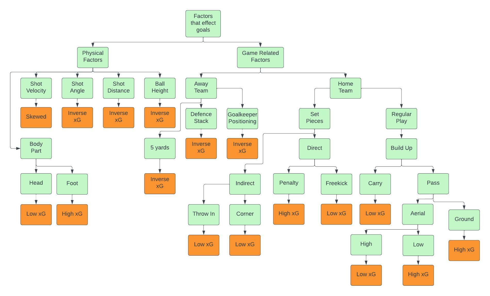
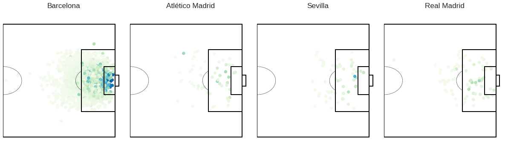
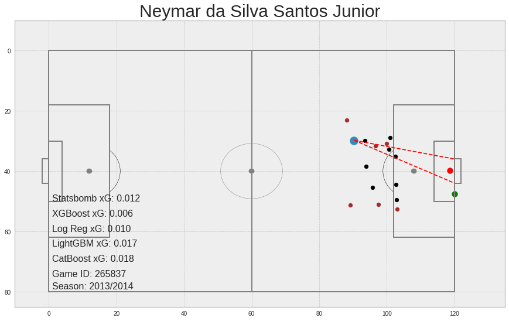
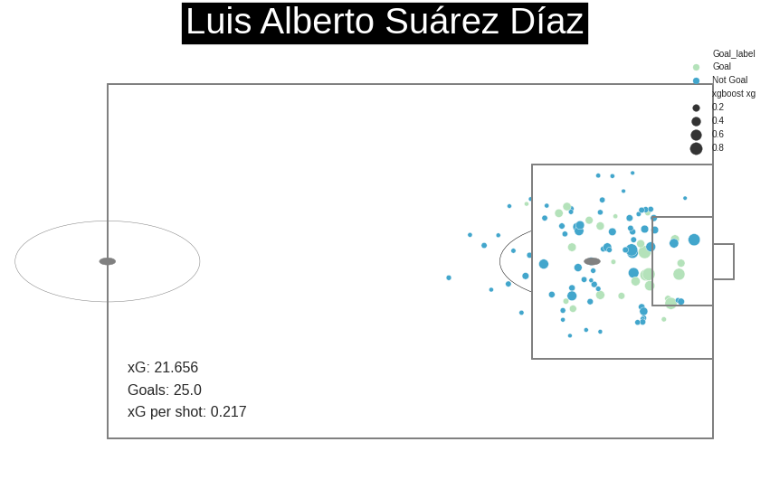
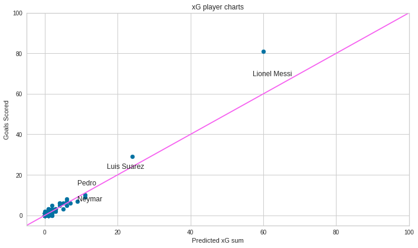

# Expected Goals (xG) Model — FC Barcelona

An end-to-end data science project that builds an **Expected Goals (xG) model** for FC Barcelona using StatsBomb open-data event feeds. The project covers the full ML pipeline: data extraction from the StatsBomb API → data cleaning → EDA → model training — and was submitted as an **MSc Computer Science & Technology thesis**.

> **Thesis:** `Maria_349256_Thesis_MScCSTE.pdf` · **Presentation:** `Thesis Presentation.pptx`

---

## What is xG?

Expected Goals (xG) is a metric that measures the probability of a shot resulting in a goal, on a scale of 0 to 1. An xG model uses historical shot data with similar characteristics to estimate chance quality. For example, a shot with xG = 0.2 would be expected to result in a goal roughly twice in every 10 attempts.

### Key Factors that Influence xG

| Physical Factors | Game-Related Factors |
|---|---|
| Shot velocity | Away / Home team |
| Shot angle | Set-piece type |
| Shot distance | Type of assist (throughball, cross, dribble) |
| Ball height | Goalkeeper position |



---

## Project Pipeline

```
StatsBomb Open Data (GitHub API)
          ↓
  Data Extraction.ipynb    ← fetch_url(), obtain_seasons(), Game class
          ↓
  Cleaning_Data.ipynb      ← filter shots, handle nulls, feature engineering
          ↓
  EDA + Model.ipynb        ← visualisations, logistic regression / ML model
          ↓
  Half_Pitch.ipynb         ← pitch map visualisation of shots
  Pitch_Plot.ipynb         ← full pitch shot location plots
```

---

## Notebooks

| Notebook | Description |
|---|---|
| `Data Extraction.ipynb` | Fetches event-level JSON data for all FC Barcelona seasons from the StatsBomb open-data GitHub repo using `requests` and `BeautifulSoup`. Builds a `Game` object per match mapping game IDs to event data. |
| `Cleaning_Data.ipynb` | Imports the raw event data, filters for shot events, engineers features (`distance_to_goal`, `angle_to_goal`, `body_part`, `technique`, `under_pressure`), and handles missing values. |
| `EDA+Model.ipynb` | Full exploratory data analysis with visualisations followed by model training and evaluation (logistic regression xG model). |
| `Half_Pitch.ipynb` | Plots shot locations on a half-pitch diagram colour-coded by outcome (goal / no goal). |
| `Pitch_Plot.ipynb` | Full-pitch shot map visualisations for player and team analysis. |

---

## Data Source

This project uses **StatsBomb open data** — freely available event-level football data:

- **Competitions index:** `https://raw.githubusercontent.com/statsbomb/open-data/master/data/competitions.json`
- **Match events:** `https://raw.githubusercontent.com/statsbomb/open-data/master/data/events/{game_id}.json`
- **FC Barcelona** data is sourced from La Liga seasons available in the StatsBomb open-data repository (Competition ID: 11)

If you publish work based on this data, credit **StatsBomb** and use their logo, as required by the [open-data terms](https://github.com/statsbomb/open-data).

### Building the shot data

The `xg/` package and `scripts/build_shots.py` download StatsBomb open data, cache it locally in `data/raw/`, and produce one row per shot with the model features. This replaces the old `Data Extraction.ipynb` scraping step and the pickles that were only kept on Google Drive.

```bash
pip install -r requirements.txt

# The thesis dataset: every La Liga match Barcelona played, 2004/05–2020/21 (~45 s, ~150 MB cache)
python scripts/build_shots.py --competition "La Liga" --team Barcelona \
    --seasons 2004/2005-2020/2021 --out data/shots_laliga_barcelona.parquet

# Run the tests
python -m pytest
```

The output has the same 24 columns as the original `laliga_data.pkl`, plus `freeze_frame_available`, `gk_in_freeze_frame` and `competition`. To use it in `EDA+Model.ipynb`, replace `pd.read_pickle('./laliga_data.pkl')` with `pd.read_parquet('data/shots_laliga_barcelona.parquet')`.

Compared with the 2022 thesis data, StatsBomb has since added a few matches, re-issued some matches with corrected events, renamed some players and teams, and updated its own xG model (the `official xg` column). The goalkeeper-position bug from the original cleaning code is also fixed: shots whose freeze frame has no goalkeeper now get the goal-centre position and `gk_in_freeze_frame = False`, instead of the previous shot's keeper position.

---

## Tech Stack

| Layer | Technology |
|---|---|
| Language | Python 3.7+ |
| Data Fetching | `requests`, `BeautifulSoup4` |
| Data Processing | `pandas`, `numpy` |
| Visualisation | `matplotlib`, `mplsoccer` / custom pitch plots |
| Modelling | `scikit-learn` (Logistic Regression) |
| Notebooks | Jupyter / Google Colab |
| Data Source | StatsBomb Open Data |

---

## Project Structure

```
Expected-xG-Goals-Football/
├── xg/
│   ├── data.py                  # Download + cache StatsBomb open data
│   └── features.py              # Events → one row per shot with model features
├── scripts/
│   └── build_shots.py           # Command-line build of the shot table
├── tests/                       # pytest tests (no network needed)
├── data/                        # Created by build_shots.py (not committed)
├── src/
│   ├── Data Extraction.ipynb    # Original scraping step (superseded by xg/ and scripts/)
│   ├── Cleaning_Data.ipynb      # Data wrangling & feature engineering
│   ├── EDA+Model.ipynb          # EDA, model training & evaluation
│   ├── Half_Pitch.ipynb         # Half-pitch shot map
│   └── Pitch_Plot.ipynb         # Full-pitch shot map
├── Maria_349256_Thesis_MScCSTE.pdf  # MSc thesis document
├── Thesis Presentation.pptx         # Thesis presentation slides
├── factors.jpeg                     # xG factors diagram
├── ff.png                           # Expected goals visual
├── neymar.png                       # Player xG chart (Neymar)
├── suarez.png                       # Player xG chart (Suarez)
├── team.png                         # Team-level xG chart
├── predicted.png                    # Model prediction output
└── LICENSE
```

---

## Setup

**1. Clone the repo**
```bash
git clone https://github.com/AyushMaria/Expected-xG-Goals-Football.git
cd Expected-xG-Goals-Football
```

**2. Install dependencies**
```bash
pip install requests beautifulsoup4 lxml pandas numpy matplotlib scikit-learn
```

**3. Run notebooks in order**

Open Jupyter or upload to Google Colab and run in sequence:
```
1. src/Data Extraction.ipynb
2. src/Cleaning_Data.ipynb
3. src/EDA+Model.ipynb
4. src/Half_Pitch.ipynb  (optional — visualisation only)
5. src/Pitch_Plot.ipynb  (optional — visualisation only)
```

> All notebooks were developed and tested on **Google Colab** (Python 3.7). No StatsBomb API key is required — only the free open-data GitHub repository is used.

---

## xG Applications Demonstrated

### Team Analysis
Compares a team's actual goals against their xG across a season to identify over/under-performance.



### Player Analysis
Tracks individual player shot quality and finishing efficiency relative to xG.




### Predictive Modelling
The trained logistic regression model outputs a per-shot xG probability, which can be used for match outcome prediction.



---

## Key Concepts

| Concept | Detail |
|---|---|
| xG scale | 0 (impossible) to 1 (certain goal) |
| Penalty xG | Static value of 0.76 (historical conversion rate) |
| Model accuracy | 79%–93% of team seasons match xG within 95% CI (Maurath) |
| Variance advantage | ~25–30 shots per match vs. ~2.5 goals — shots are more reliable signal |

---

## References

1. StatsBomb — [Expected Goals (xG) Explained](https://statsbomb.com/soccer-metrics/expected-goals-xg-explained/)
2. Tuyls, Karl, et al. "Game Plan: What AI can do for Football, and What Football can do for AI." *Journal of Artificial Intelligence Research* 71 (2021): 41–88.
3. StatsBomb Open Data — https://github.com/statsbomb/open-data

---

## License

MIT — see [LICENSE](LICENSE) for details. Feel free to open a Pull Request to suggest improvements or extend the analysis.
