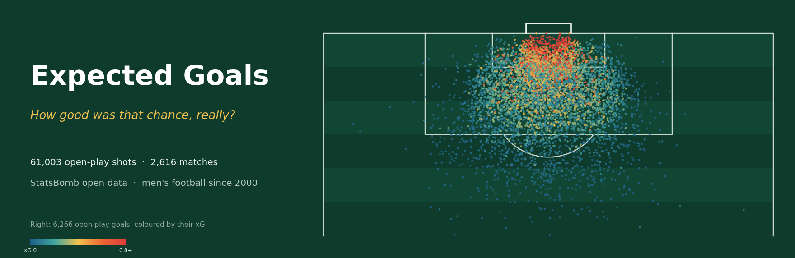
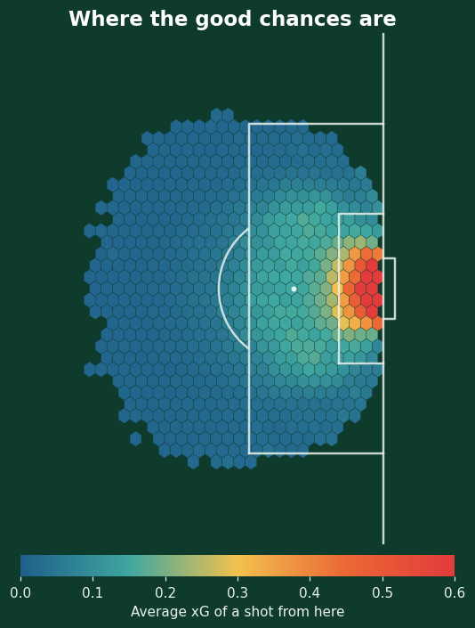
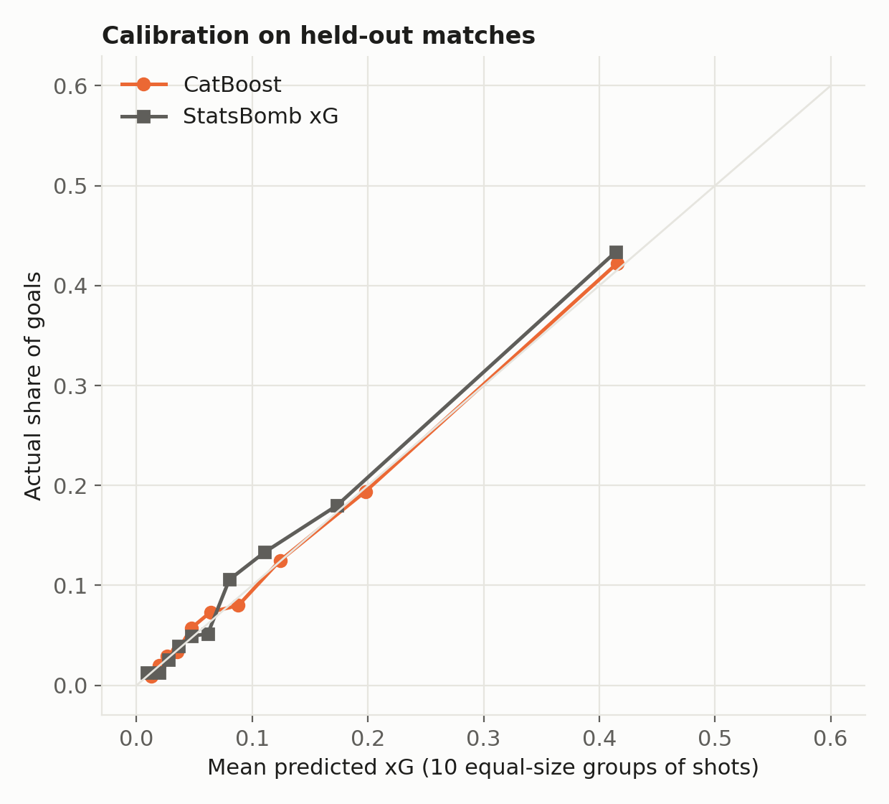
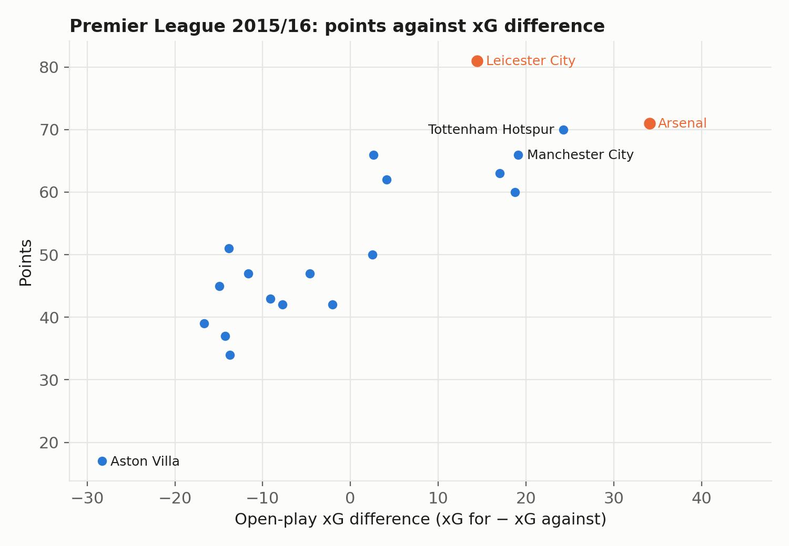
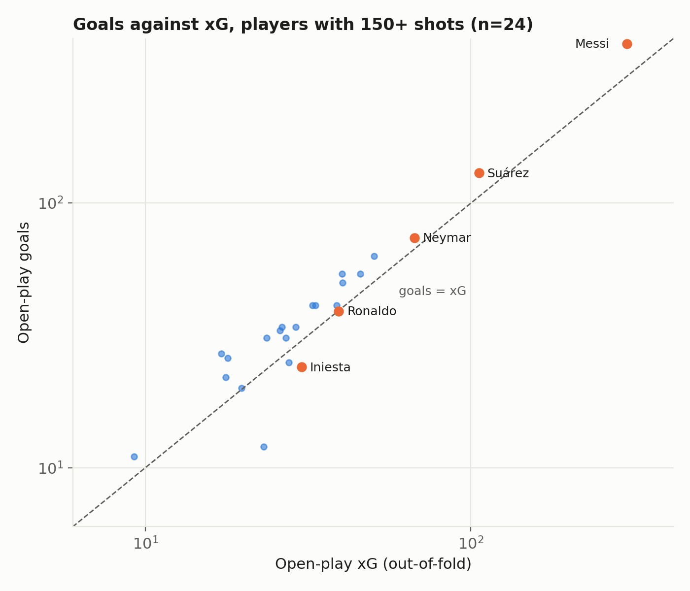
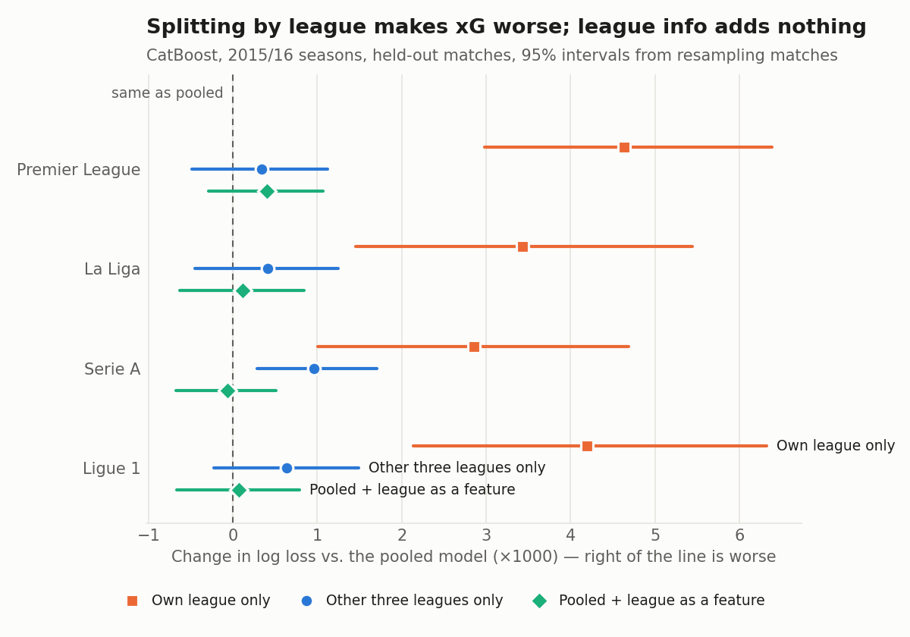
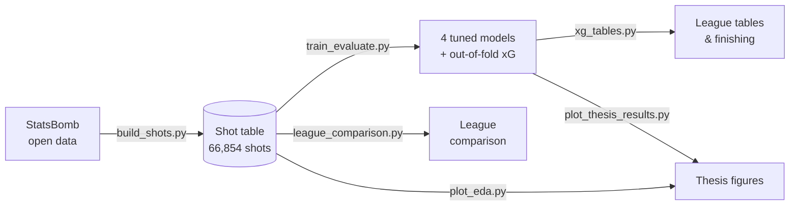

<p align="center">
  
</p>

<h1 align="center">Expected Goals (xG) in Football</h1>

<p align="center">
  <em>An xG model trained on 61,003 open-play shots from 2,616 men's matches, tested on matches it has never seen,<br>and used to read teams, players and leagues.</em>
</p>

<p align="center">
  
  
  
  
  
</p>

<p align="center">
  <a href="#-the-final-score">Results</a> ·
  <a href="#-post-match-analysis">Teams &amp; players</a> ·
  <a href="#-one-model-many-leagues">Leagues</a> ·
  <a href="#-the-thesis">Thesis</a> ·
  <a href="#-kick-off">Quick start</a>
</p>

---

## ⚽ What is xG?

**Expected Goals (xG)** is the probability that a shot becomes a goal, judged *before* it is struck: where it was taken from, the angle on goal, how the ball arrived, and where the defenders and goalkeeper were standing. A shot with xG 0.20 goes in about one time in five.

Add up a player's or a team's xG and you get the goals their chances were worth. Compare that with the goals they actually scored, and you can separate **making chances** from **taking them**.

<p align="center">
  
</p>

The model reads each shot through **13 features**. Five of them come from StatsBomb's *freeze frames*, which record where every player stood at the moment of the shot:

| 📐 Geometry | 🛡️ Defence | 🧤 Goalkeeper | 🎯 Situation |
|---|---|---|---|
| Shot distance | Opponents within 5 yards | Keeper's distance from goal | Body part (foot / head) |
| Shot angle | Opponents between ball and goal | Keeper's x and y position | Height of the key pass |
| Shot x and y position | | | Play pattern · First-time shot |

---

## 🏆 The final score

Four algorithms were tuned by cross-validated log loss, then tested once on **524 held-out matches** (12,009 shots). The train/test split is by match, so no match has shots on both sides.

| Model | Log loss ↓ | AUC ↑ | Calibration error ↓ | Predicted ÷ actual goals |
|---|:-:|:-:|:-:|:-:|
| Logistic Regression | 0.2699 | 0.804 | 0.0047 | 1.00 |
| XGBoost | 0.2686 | 0.806 | 0.0058 | 0.99 |
| LightGBM | 0.2696 | 0.804 | 0.0065 | 0.99 |
| **CatBoost** (chosen on CV) | 0.2687 | 0.806 | 0.0048 | 0.99 |
| *StatsBomb xG (reference)* | *0.2647* | *0.813* | *0.0101* | *0.94* |

<table>
<tr>
<td width="50%"></td>
<td width="50%">

**What the scoreline says**

- 🎯 **Every model is calibrated.** All four predict within 1.5% of the goals actually scored, so their xG can be summed over players and teams.
- 🤝 **The algorithm barely matters.** The four models are within 0.0013 log loss of each other. Logistic regression is statistically level with CatBoost.
- 📏 **Geometry wins.** Shot angle, distance and the bodies between ball and goal carry most of the signal. Body part, pressure and pass height only show their effect once distance is held fixed.

</td>
</tr>
</table>

Full details: [`docs/RESULTS.md`](docs/RESULTS.md).

---

## 📊 Post-match analysis

Every shot also gets an **out-of-fold xG** from a model that never saw its match, which makes fair team and player tables possible.

<table>
<tr>
<td width="50%"></td>
<td width="50%"></td>
</tr>
<tr>
<td>

**🦊 Leicester, 2015/16.** Champions on 81 points, but only **6th** on open-play xG difference. Arsenal had the best chances in the league (+34.1) and finished second.

</td>
<td>

**🐐 Messi.** 400 open-play goals from chances worth **301 xG**: almost 99 more than an average finisher would have scored, at *z* = +6.8. Suárez (+24) and Mbappé (+14) also clearly beat their xG.

</td>
</tr>
</table>

| Player | Shots | Goals | xG | Goals − xG | z |
|---|:-:|:-:|:-:|:-:|:-:|
| Lionel Messi | 2,107 | 400 | 301.2 | **+98.8** | +6.8 |
| Luis Suárez | 601 | 130 | 106.0 | +24.0 | +2.9 |
| Neymar | 407 | 74 | 67.2 | +6.8 | +1.0 |
| Andrés Iniesta | 367 | 24 | 30.2 | −6.2 | −1.3 |

Iniesta's low tally is about the chances, not the finishing: his average shot was worth 0.082 xG, against 0.103 across all shots. Barcelona as a team beat their xG in **15 of 17** La Liga seasons. Tables for all four 2015/16 leagues: [`docs/TABLES.md`](docs/TABLES.md).

---

## 🌍 One model, many leagues?

Does each league's style of play bias a model trained on all of them? On the four complete 2015/16 seasons (Premier League, La Liga, Serie A, Ligue 1):

<p align="center">
  
</p>

- ✅ **A pooled model is calibrated in every league** (0.98 to 1.03 of actual goals).
- ✅ **It transfers to a league it has never seen**, almost as accurately.
- ❌ **Separate models per league are worse.** Fewer shots costs more than specialising gains.
- ⚠️ **A league of a different standard is another story.** In the Indian Super League, the model predicts 12% fewer goals than were scored, and StatsBomb's own model shows the same gap.

Full details: [`docs/LEAGUES.md`](docs/LEAGUES.md).

---

## 📘 The thesis

This project began as an MSc thesis at **Cranfield University** (*Computational and Software Techniques in Engineering*, 2022).

| Edition | Data | File |
|---|---|---|
| Original (2022) | 520 La Liga matches, all involving FC Barcelona | [`Maria_349256_Thesis_MScCSTE.pdf`](Maria_349256_Thesis_MScCSTE.pdf) |
| **Revised (2026)** | 2,616 men's matches across leagues and tournaments | [`thesis/Maria_349256_Thesis_MScCSTE_revised.pdf`](thesis/Maria_349256_Thesis_MScCSTE_revised.pdf) |

The revised edition redoes the study on the full men's open data:
- every figure is redrawn and every claim re-checked;
- the data is split by match, tuned by cross-validation and checked for calibration;
- it adds the team, player and league analyses above.

Its LaTeX source is in [`thesis/`](thesis/).

---

## 🧭 The tactics board



| Module | Role |
|---|---|
| [`xg/data.py`](xg/data.py) | Downloads and caches StatsBomb open data (competitions, matches, events) |
| [`xg/features.py`](xg/features.py) | Turns events into one row per shot, with the freeze-frame features |
| [`xg/model.py`](xg/model.py) | Modelling set, match-grouped split, tuning, calibration metrics |
| [`xg/tables.py`](xg/tables.py) | League tables with xG, and goals-vs-xG finishing tables |
| [`xg/compare.py`](xg/compare.py) | Match-bootstrap confidence intervals |

---

## 🚀 Kick-off

```bash
git clone https://github.com/AyushMaria/Expected-xG-Goals-Football.git
cd Expected-xG-Goals-Football
pip install -r requirements.txt

python scripts/build_shots.py --gender male --out data/shots_all_men.parquet       # ~9 min, ~700 MB cache
python scripts/train_evaluate.py --shots data/shots_all_men.parquet --out results  # ~6 min on 2 cores
python scripts/xg_tables.py --oof results/oof_xg.parquet --out docs/TABLES.md
python scripts/league_comparison.py --shots data/shots_all_men.parquet --results results

python -m pytest                                                                   # 17 tests, no network needed
```

No API key is needed: everything comes from StatsBomb's free open-data repository. [`docs/DATA.md`](docs/DATA.md) describes the dataset competition by competition. To rebuild the thesis figures and PDF, see [`thesis/README.md`](thesis/README.md).

<details>
<summary><b>Original notebooks (2022)</b></summary>

The notebooks in [`src/`](src/) are the original thesis pipeline (Barcelona's La Liga matches only). They are kept for reference. The `xg/` package and `scripts/` replace them.

| Notebook | What it did |
|---|---|
| `Data Extraction.ipynb` | Fetched StatsBomb event data |
| `Cleaning_Data.ipynb` | Built the shot table and features |
| `EDA+Model.ipynb` | Exploratory analysis, model training and evaluation |
| `Half_Pitch.ipynb`, `Pitch_Plot.ipynb` | Pitch drawings and shot maps |

To run `EDA+Model.ipynb` on the rebuilt data, build the Barcelona set with `python scripts/build_shots.py --competition "La Liga" --team Barcelona --seasons 2004/2005-2020/2021 --out data/shots_laliga_barcelona.parquet`. Then load it with `pd.read_parquet` instead of the old pickle.

</details>

---

## 📁 Squad list

```
Expected-xG-Goals-Football/
├── xg/            # the Python package (data, features, model, tables, compare)
├── scripts/       # command-line steps of the pipeline, and figure scripts
├── docs/          # DATA, RESULTS, TABLES, LEAGUES write-ups, figures and README assets
├── thesis/        # revised thesis: LaTeX source, images and PDF
├── tests/         # pytest suite
├── src/           # original 2022 notebooks
├── data/          # built by build_shots.py (not committed)
└── results/       # built by train_evaluate.py (not committed)
```

---

## 🙏 Credits

- **Data:** [StatsBomb open data](https://github.com/statsbomb/open-data). Work using this data must credit StatsBomb, as its terms require.
- **Background:** StatsBomb, [*What are Expected Goals (xG)?*](https://statsbomb.com/soccer-metrics/expected-goals-xg-explained/) · Tuyls et al., "Game Plan: What AI can do for Football, and What Football can do for AI", *JAIR* 71 (2021).
- **Author:** Ayush Maria. MSc thesis at Cranfield University, supervised by Dr. Jun Li.

Released under the [MIT License](LICENSE).
