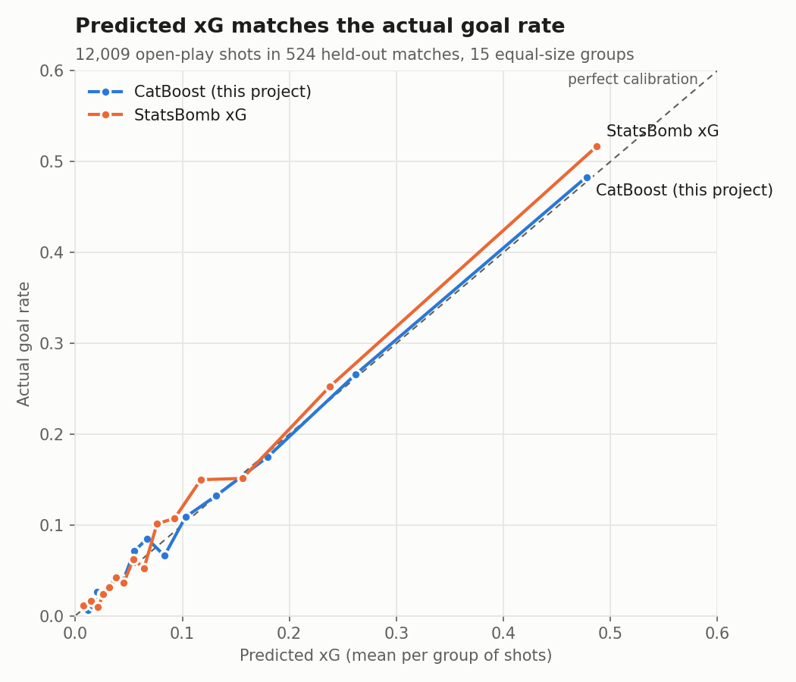
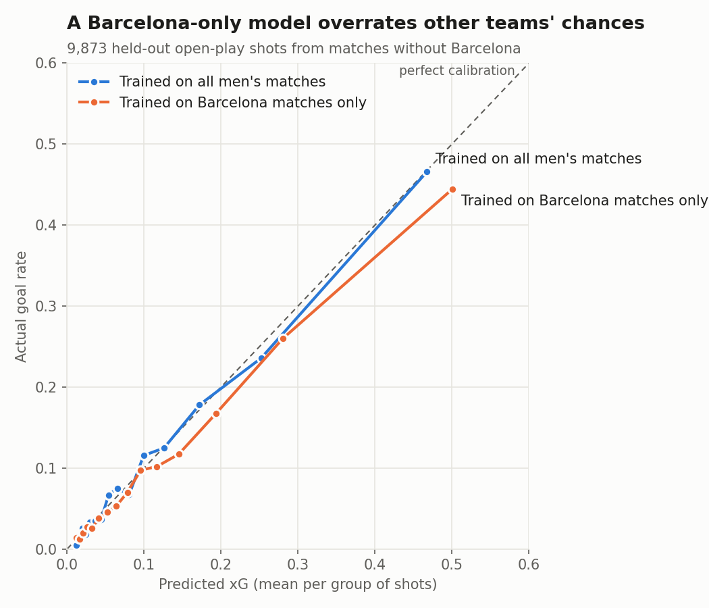

# Results: xG models on StatsBomb men's open data

Step 3 of the rebuild: the thesis features, evaluated properly on the men's StatsBomb data described in [DATA.md](DATA.md).

```bash
python scripts/train_evaluate.py --shots data/shots_all_men.parquet --out results   # ~6 min on 2 CPU cores
python scripts/plot_results.py                                                       # figures below
```

## Set-up
- **Data:** 61,003 open-play shots (6,277 goals) from 2,616 men's matches since 2000. Same features as the thesis: 9 numeric (distance, angle, defenders, goalkeeper position, shot location) and 4 categorical (body part, pass type, play pattern, first time).
- **Held-out test set:** 20% of *matches* (524 matches, 12,009 shots), so no match has shots on both sides (card #13). Everything below is measured on these matches unless stated.
- **Tuning:** each model's settings were chosen by 5-fold cross-validated log loss, grouped by match, on the training matches only (card #15). The best model was picked on cross-validation, not on the test set.
- **Calibration (card #14):** besides AUC, every model is checked for whether its predictions match reality.
  - *Calibration error (ECE):* the average gap between predicted xG and the actual goal rate, across 10 equal-size groups of shots.
  - *Predicted ÷ actual goals:* total xG divided by goals. 1.00 is perfect; above 1 means too many goals were predicted.

## 1. All four models are well calibrated, and nearly tied

| Model | CV log loss | Test log loss | Brier | AUC | Calibration error (ECE) | Predicted ÷ actual goals |
|---|---|---|---|---|---|---|
| Logistic Regression | 0.2655 | 0.2699 | 0.0776 | 0.804 | 0.0047 | 1.00 |
| XGBoost | 0.2640 | 0.2686 | 0.0771 | 0.806 | 0.0058 | 0.99 |
| LightGBM | 0.2642 | 0.2696 | 0.0774 | 0.804 | 0.0065 | 0.99 |
| **CatBoost** | 0.2637 | 0.2687 | 0.0772 | 0.806 | 0.0048 | 0.99 |
| StatsBomb xG | – | 0.2647 | 0.0759 | 0.813 | 0.0101 | 0.94 |



- **The choice of algorithm barely matters.** Test log loss differs by 0.0013 across the four models, and AUC by 0.002. This matches the corrected thesis conclusion: the features describing the shot matter more than the algorithm.
- **Predictions match reality.** All four models predict within 1.5% of the actual number of goals, with a calibration error of about half a percentage point.
- **StatsBomb's xG is a reference point, not a fair competitor.** It scores slightly better on log loss and AUC, but StatsBomb trained it on far more data and more information than these 13 features, very likely including these same matches. On these matches it predicts about 6% fewer goals than were scored.

## 2. The thesis set-up overrates other teams' chances

The same model with the same settings, trained only on the Barcelona matches in the training set (9,715 shots, the thesis set-up), compared with the model trained on all men's matches:

| Held-out shots | Shots | Goals | Model | Log loss | Calibration error (ECE) | Predicted ÷ actual goals |
|---|---|---|---|---|---|---|
| Barcelona's shots | 1,312 | 205 | Barcelona-only (thesis setup) | 0.3504 | 0.0181 | 0.95 |
| Barcelona's shots | 1,312 | 205 | All men's matches | 0.3482 | 0.0258 | 0.85 |
| Shots in non-Barcelona matches | 9,873 | 983 | Barcelona-only (thesis setup) | 0.2667 | 0.0123 | 1.12 |
| Shots in non-Barcelona matches | 9,873 | 983 | All men's matches | 0.2618 | 0.0043 | 1.00 |



- **Trained on Barcelona only, the model predicts 12% more goals than other teams actually score**, and it is worse on every measure for those matches (log loss, calibration error).
- **Trained on all men's matches, it predicts other teams' goals almost exactly (1.00)**, but predicts 15% fewer goals than Barcelona actually scored. That gap is Barcelona's finishing quality over these seasons, which a model trained on Barcelona alone cannot see.

## 3. Calibration by competition (a first look)

| Group (held-out shots) | Shots | Goals | This model: predicted ÷ actual | StatsBomb xG: predicted ÷ actual |
|---|---|---|---|---|
| La Liga | 3,575 | 425 | 0.95 | 0.90 |
| Premier League | 2,204 | 185 | 1.14 | 1.09 |
| Ligue 1 | 1,920 | 194 | 1.02 | 0.98 |
| Serie A | 1,834 | 167 | 1.01 | 0.96 |
| Indian Super league | 657 | 78 | 0.83 | 0.81 |
| FIFA World Cup | 494 | 61 | 0.87 | 0.83 |
| UEFA Euro | 412 | 44 | 0.88 | 0.87 |
| 1. Bundesliga | 318 | 35 | 1.06 | 0.99 |
| African Cup of Nations | 293 | 30 | 0.95 | 0.88 |
| Copa America | 186 | 21 | 0.96 | 0.93 |
| Champions League | 80 | 10 | 0.72 | 0.67 |
| Barcelona's shots | 1,312 | 205 | 0.85 | 0.81 |
| All other shots | 10,697 | 1,048 | 1.01 | 0.97 |

- **The big leagues are mostly within a few percent.** The Premier League stands out (1.14), but its held-out sample has only 185 goals, and StatsBomb's own xG shows the same direction (1.09).
- **International tournaments (World Cup, Euro) scored more than predicted** by both models. This could be a real tournament effect or chance in small samples.
- **Small groups are noisy.** With a few hundred goals or fewer, ratios can move by ±10% by chance. Step 4 tests the league question properly, using the 2015/16 full seasons with confidence intervals.

## 4. Out-of-fold xG for every shot

For team and player analysis (card #6), every shot also gets an xG from a model that never saw its match (5-fold cross-validation grouped by match). Across all 61,003 shots these predictions have log loss 0.2645, AUC 0.809, calibration error 0.003, and predict 99.7% of actual goals. They are saved to `results/oof_xg.parquet`.

## Chosen settings

- **Logistic Regression** (20 settings tried, 41 s): `C`=0.144
- **XGBoost** (20 settings tried, 78 s): `colsample_bytree`=0.837, `learning_rate`=0.023, `max_depth`=4, `min_child_weight`=6.343, `n_estimators`=561, `reg_lambda`=8.982, `subsample`=0.889
- **LightGBM** (20 settings tried, 112 s): `colsample_bytree`=0.78, `learning_rate`=0.01, `min_child_samples`=108, `n_estimators`=415, `num_leaves`=20, `reg_lambda`=7.247, `subsample`=0.722
- **CatBoost** (12 settings tried, 150 s): `depth`=7, `iterations`=302, `l2_leaf_reg`=4.556, `learning_rate`=0.025

## Comparing with the thesis
The thesis reported test AUCs of 0.80–0.82, but those were measured on Barcelona matches, with shots from the same match on both sides of the split. The numbers here (AUC 0.804–0.806) are measured on unseen matches across many competitions, so they are a harder and more honest test, not a drop in quality.
